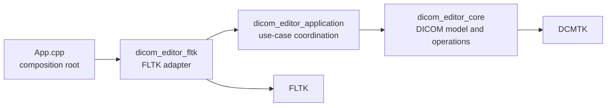
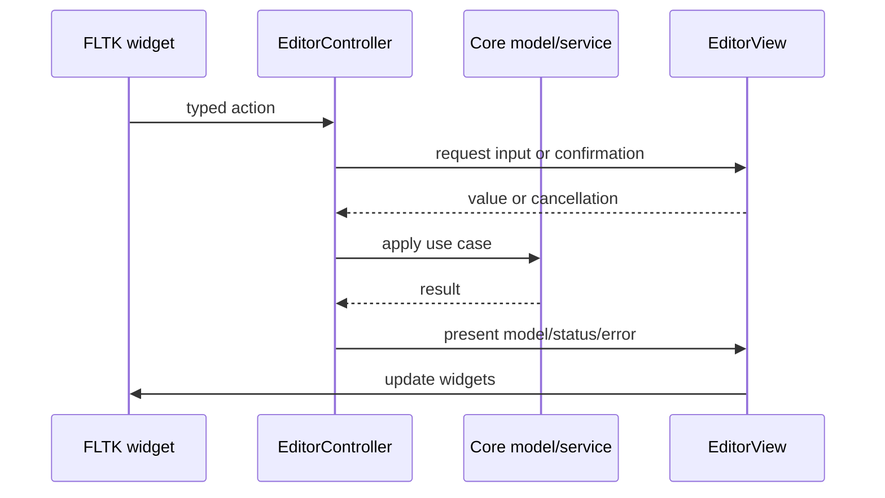

# Architecture

This project uses three layers and one composition root. The split follows
dependency direction, not whether code eventually serves a GUI.

Dependencies point inward. Core knows nothing about windows, menus, file
choosers, or FLTK. Application knows only the abstract `EditorView` port. FLTK
implements that port and translates widget events into controller calls.

## Source And Target Layout

| Path | CMake target | Responsibility |
| --- | --- | --- |
| `include/dicom_editor/core`, `src/core` | `DicomDatasetEditor::core` | DICOM ownership, editing, loading, hierarchy, preview rendering, dictionary management |
| `include/dicom_editor/application`, `src/application` | `DicomDatasetEditor::application` | User workflows, presentation state, save/close policy, view updates |
| `src/gui/fltk` except `App.cpp` | `DicomDatasetEditor::fltk` | Widgets, layout, dialogs, native file choosers, event adaptation |
| `src/gui/fltk/App.cpp` | `dicom-dataset-editor` | Constructs main window and starts FLTK event loop |

`EditorController` belongs to application layer, not FLTK layer. It coordinates
GUI use cases, but has no GUI toolkit dependency. Moving it into core would make
core own dialog policy and presentation state; moving it into FLTK would prevent
reuse by another UI adapter or headless workflow.

For a first code-reading pass, follow one action end to end: a callback in
`EditorWindow.cpp`, its use case in `EditorController.cpp`, and the model
operation in `src/core`. `EditorWindowDialogs.cpp` contains blocking prompts,
file choosers, and the modal Save All runner so the main window file stays
focused on widget construction, layout, presentation, and event dispatch.

## State Ownership

- `DicomDocument` owns one `DcmFileFormat`, file path, dirty state, and a small
  cached hierarchy projection. Mutable dataset access and editor mutations
  invalidate that projection.
- `DicomWorkspace` owns all documents, active-document selection, discovery,
  ordering, DICOMDIR resolution, and scoped batch edits.
- `EditorController` owns workspace plus session presentation state: validation,
  file sort order, pixel-preview visibility, and current frame.
- `EditorWindow` owns widgets and layout state only. Panels receive models and
  emit typed callbacks; they do not mutate documents.
- DCMTK owns its process-global data dictionary. `DicomDictionary` is the sole
  project API allowed to replace it.

Avoid duplicate state. For example, active document lives in `DicomWorkspace`;
file tree only renders `OpenDicomFile::active`.

Clean inactive documents remain loaded. DCMTK already defers large element values
such as Pixel Data, while unloading whole datasets would add activation I/O and
failure handling throughout the controller. Revisit full lazy loading only when
the synthetic benchmark and representative datasets show that retained metadata
is a material memory problem.

## Request And Presentation Flow

Most controller methods are synchronous. Save All is the deliberate exception:
the application supplies a toolkit-neutral save task to `EditorView`, and the
FLTK adapter runs it on a `std::jthread` behind a modal progress window. The
worker updates only core state. Progress wakes the FLTK event loop with
`Fl::awake`; only the FLTK thread reads progress and touches widgets. Cancellation
uses a stop token and is observed between files, so an in-progress DCMTK write is
allowed to finish before the worker joins and the progress window closes.

The `EditorView` boundary uses small presentation structs rather than parallel
arguments. This names each value at construction, makes view updates easy to
extend, and keeps toolkit-neutral presentation data in the application layer.

### Targeted Refreshes

`EditorController::refreshView()` remains the full presentation path for active
file changes and completed operations. Internally, document, open-file tree, and
Pixel Data presentation are separate refreshes so workflows update only affected
state.

- A metadata batch edit scans the workspace once, validates the replacement once,
  and updates every matching document. It then presents the active dataset and
  dirty/hierarchy file tree once. Pixel Data is not rerendered.
- Save All never activates documents and never presents intermediate document
  state. It performs one full refresh after success, cancellation, or partial
  failure, preserving the user's active file throughout.
- Pixel frame and file navigation still use a full refresh because they change
  preview identity as well as active presentation state.

This separation avoids rebuilding the dataset tree, hierarchy, and potentially
expensive preview for every file in a batch operation.

## Save Lifecycle

`DicomDocument` owns rollback-safe persistence. Saving a file follows this
per-file transaction:

1. Write a unique sibling temporary file while the original remains available
   for DCMTK deferred Pixel Data reads.
2. Use the document's original transfer syntax. Use Explicit Little Endian only
   when DCMTK reports an unknown original syntax, avoiding unintended
   compression or decompression.
3. Rename an existing target to a sibling backup, then move the completed
   temporary file into place.
4. Reload the saved file into the same `DicomDocument`. This verifies readability,
   clears dirty state, restores deferred loading, and bounds memory across large
   batches.
5. Remove the backup after reload succeeds. If replacement or reload fails,
   restore the backup and leave the document dirty.

Save All operates on dirty, file-backed documents only. It reports progress as
completed count, total count, and current path; records path-specific failures;
continues after individual failures; and returns whether cancellation occurred.
Completed files remain saved when later files fail or the user cancels, so the
operation is rollback-safe per file rather than atomic across the workspace.

## Core Roles

- `DicomDocument`: DCMTK file facade and per-document behavior.
- `DicomWorkspace`: multi-document aggregate and navigation policy.
- `DicomEditorService`: validated element add/edit/delete operations.
- `DicomPath`: stable address for nested sequence items and elements.
- `DatasetViewModel`: toolkit-neutral filtering and row formatting.
- `DicomDictionary`: embedded dictionary bootstrap and validated runtime replacement.

DCMTK types remain visible inside core API because this application directly
edits DCMTK datasets. Hiding every DCMTK type would add a large mirror model with
little isolation benefit. Toolkit types are different: they stop at FLTK adapter
boundary.

## Dictionary Lifecycle

Build configuration reads Conan-provided `dicom.dic` and generates a C++
resource compiled into `dicom_editor_core`. No dictionary file is installed.

On first `DicomDocument` construction:

1. Embedded bytes are written to a short-lived temporary file because DCMTK's
   public loader accepts a filename.
2. DCMTK validates and loads that file.
3. Temporary file is removed.

`Settings > Load Data Dictionary...` accepts any dictionary file DCMTK accepts.
Candidate is parsed before process-global dictionary is replaced, so invalid
input leaves active dictionary unchanged. Override lasts for current process;
next launch returns to embedded version. This avoids stale user configuration
silently shadowing dictionary shipped with a newer app.

## Change Rules

- New DICOM behavior goes in core and gets core-level tests.
- New user workflow goes through `EditorController` and `EditorView`.
- New FLTK widget behavior stays under `src/gui/fltk`.
- Core and application headers must not include FLTK headers.
- Panels emit semantic callbacks such as activate file or batch edit, not raw
  FLTK events.
- Keep `App.cpp` free of policy; it is only composition root.
- Add another GUI by implementing `EditorView`; do not fork core workflows.
