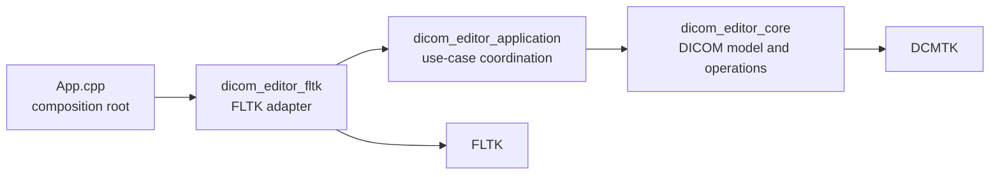
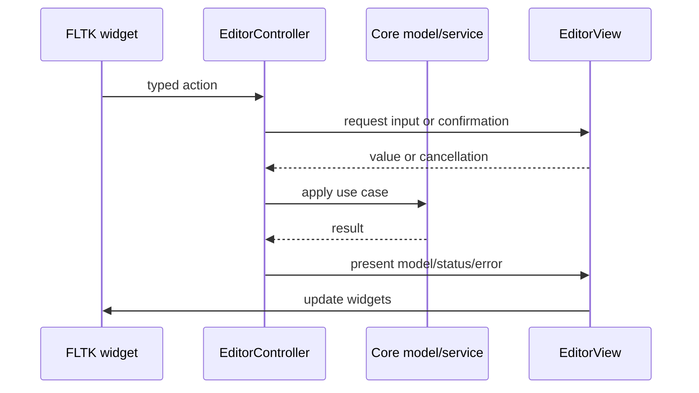

# Architecture

This project uses three layers and one composition root. The split follows
dependency direction, not whether code eventually serves a GUI.

Dependencies point inward. Core knows nothing about windows, menus, file
choosers, or FLTK. Application knows only the abstract `EditorView` port. FLTK
implements that port and translates widget events into controller calls.

## Source And Target Layout

| Path | CMake target | Responsibility |
| --- | --- | --- |
| `include/dicom_editor/core`, `src/core` | `DicomDatasetEditor::core` | DICOM ownership, editing, loading, hierarchy, preview rendering, dictionary management |
| `include/dicom_editor/application`, `src/application` | `DicomDatasetEditor::application` | User workflows, presentation state, save/close policy, view updates |
| `src/gui/fltk` except `App.cpp` | `DicomDatasetEditor::fltk` | Widgets, layout, dialogs, native file choosers, event adaptation |
| `src/gui/fltk/App.cpp` | `dicom-dataset-editor` | Constructs main window and starts FLTK event loop |

`EditorController` belongs to application layer, not FLTK layer. It coordinates
GUI use cases, but has no GUI toolkit dependency. Moving it into core would make
core own dialog policy and presentation state; moving it into FLTK would prevent
reuse by another UI adapter or headless workflow.

## State Ownership

- `DicomDocument` owns one `DcmFileFormat`, file path, and dirty state.
- `DicomWorkspace` owns all documents, active-document selection, discovery,
  ordering, DICOMDIR resolution, and scoped batch edits.
- `EditorController` owns workspace plus session presentation state: validation,
  file sort order, pixel-preview visibility, and current frame.
- `EditorWindow` owns widgets and layout state only. Panels receive models and
  emit typed callbacks; they do not mutate documents.
- DCMTK owns its process-global data dictionary. `DicomDictionary` is the sole
  project API allowed to replace it.

Avoid duplicate state. For example, active document lives in `DicomWorkspace`;
file tree only renders `OpenDicomFile::active`.

## Request And Presentation Flow

Controller methods are synchronous because FLTK interactions and current core
operations are synchronous. Introduce background work only for measured blocking
operations; results must return to FLTK thread before touching widgets.

## Core Roles

- `DicomDocument`: DCMTK file facade and per-document behavior.
- `DicomWorkspace`: multi-document aggregate and navigation policy.
- `DicomEditorService`: validated element add/edit/delete operations.
- `DicomPath`: stable address for nested sequence items and elements.
- `DatasetViewModel`: toolkit-neutral filtering and row formatting.
- `DicomDictionary`: embedded dictionary bootstrap and validated runtime replacement.

DCMTK types remain visible inside core API because this application directly
edits DCMTK datasets. Hiding every DCMTK type would add a large mirror model with
little isolation benefit. Toolkit types are different: they stop at FLTK adapter
boundary.

## Dictionary Lifecycle

Build configuration reads Conan-provided `dicom.dic` and generates a C++
resource compiled into `dicom_editor_core`. No dictionary file is installed.

On first `DicomDocument` construction:

1. Embedded bytes are written to a short-lived temporary file because DCMTK's
   public loader accepts a filename.
2. DCMTK validates and loads that file.
3. Temporary file is removed.

`Settings > Load Data Dictionary...` accepts any dictionary file DCMTK accepts.
Candidate is parsed before process-global dictionary is replaced, so invalid
input leaves active dictionary unchanged. Override lasts for current process;
next launch returns to embedded version. This avoids stale user configuration
silently shadowing dictionary shipped with a newer app.

## Change Rules

- New DICOM behavior goes in core and gets core-level tests.
- New user workflow goes through `EditorController` and `EditorView`.
- New FLTK widget behavior stays under `src/gui/fltk`.
- Core and application headers must not include FLTK headers.
- Panels emit semantic callbacks such as activate file or batch edit, not raw
  FLTK events.
- Keep `App.cpp` free of policy; it is only composition root.
- Add another GUI by implementing `EditorView`; do not fork core workflows.

